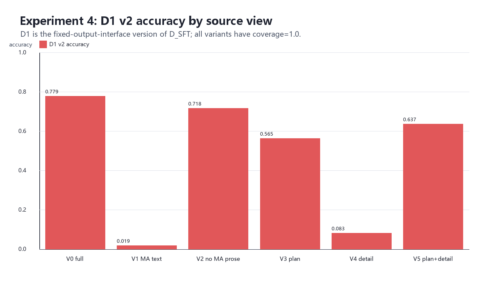
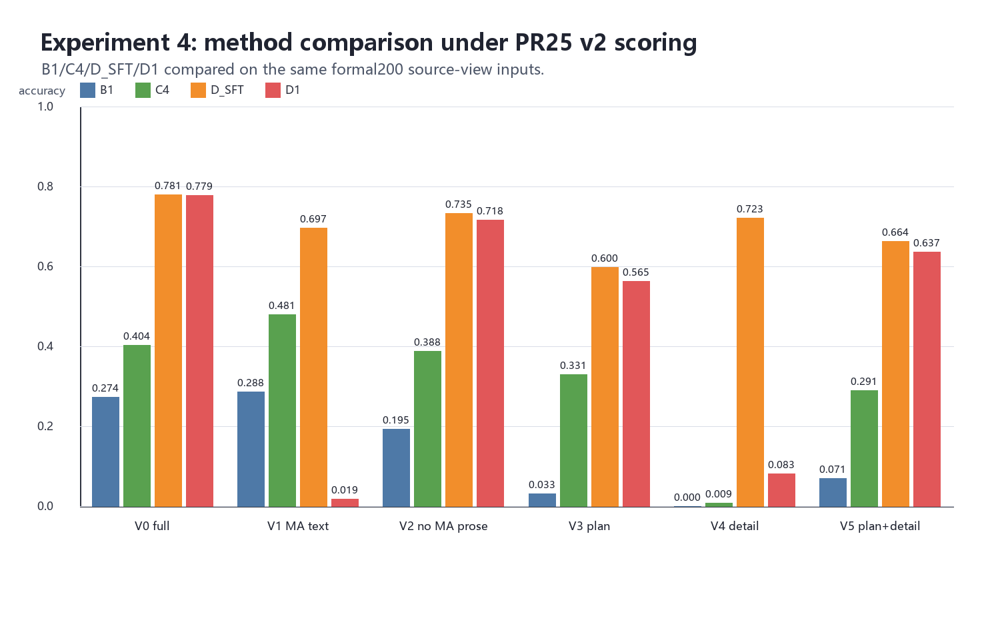
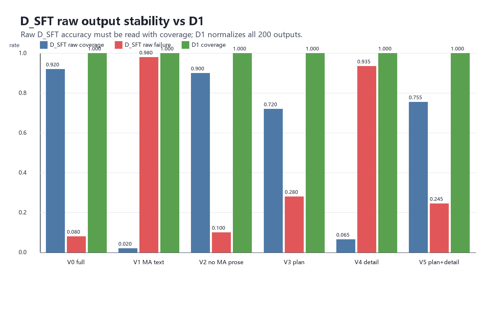

# 实验组4 source-view ablation 结果分析

生成时间：2026-05-03T01:40:16.442893+00:00

## 1. 分析口径

实验组4的主分析口径采用 `D1 + chart_display_aware_v2`。原因是 D1 沿用实验组1 PR #25 的 fixed-output-interface 处理，只把 D_SFT raw output 统一成可评分 canonical JSON，不使用 target、score、424/CIFP raw、OCR 或其它方法输出修字段答案。因此 D1 比 D_SFT raw 更适合做 200 张全量公平比较。

`D_SFT raw` 仍然保留，但主要用于分析输出格式稳定性、coverage 和 failure_rate；不应只看 raw accuracy。

## 2. 输入变体

|variant|含义|
|---|---|
|`V0_full_chart`|V0 整图 baseline|
|`V1_ma_text_only`|V1 只保留 missed approach 文本框|
|`V2_full_minus_ma_prose`|V2 遮挡 missed approach 文字说明，保留其它区域|
|`V3_plan_view_only`|V3 只保留 plan view|
|`V4_icon_detail_only`|V4 只保留 detail/icon 大框|
|`V5_plan_detail_no_ma`|V5 保留 plan view + detail/icon，不含 MA 文字说明|

## 3. D1 主结果

|variant|D1 strict accuracy|D1 v2 accuracy|coverage|failure_rate|
|---|---:|---:|---:|---:|
|`V0_full_chart`|0.733465|0.779368|1.000|0.000|
|`V1_ma_text_only`|0.019497|0.019497|1.000|0.000|
|`V2_full_minus_ma_prose`|0.673248|0.717670|1.000|0.000|
|`V3_plan_view_only`|0.547631|0.564906|1.000|0.000|
|`V4_icon_detail_only`|0.082675|0.082675|1.000|0.000|
|`V5_plan_detail_no_ma`|0.620188|0.637463|1.000|0.000|

## 4. 可以说明的问题

第一，D_SFT/D1 并不是只靠 missed approach 文字框。`V1_ma_text_only` 的 D1 v2 accuracy 只有 0.019497，但 `V2_full_minus_ma_prose` 在遮挡 missed approach 文字说明后仍有 0.717670。这说明 D_SFT/D1 的有效信息大量来自航图其它区域，而不是简单抄 MA prose。

第二，plan view 是最关键的信息来源。`V3_plan_view_only` 仍有 0.564906；`V4_icon_detail_only` 只有 0.082675；`V5_plan_detail_no_ma` 提升到 0.637463。这说明 plan view 承载了主要的路径、fix、course/radial 等信息，detail/icon 有补充价值，但单独不足。

第三，MA prose 对 D1 有帮助，但不是唯一来源。整图 `V0_full_chart` 为 0.779368，遮挡 MA prose 的 `V2` 为 0.717670，下降约 0.061698。这表示 MA prose 提供增量信息，但航图存在明显多区域冗余。

第四，OCR/规则方法和 D_SFT/D1 的依赖方式不同。C4 在 `V1_ma_text_only` 上的 v2 accuracy 为 0.480750，高于 C4 整图 0.404245。这说明 C4 更像文本驱动方法，直接依赖 missed approach 文字；D1 则更依赖图形结构、布局和上下文。

第五，D_SFT raw accuracy 不能单独解释。`V1_ma_text_only` 的 D_SFT raw v2 accuracy 为 0.697368，但 coverage 只有 0.020；`V4_icon_detail_only` 的 raw v2 accuracy 为 0.723320，但 coverage 只有 0.065。这些高分是少量幸存 schema-valid 样本上的分数，不能代表全量能力。D1 把 200 张全部纳入评分后，才暴露了局部裁剪输入下的真实表现。

## 5. V1_ma_text_only 为什么 D1 很低

这一点需要单独解释：`V1_ma_text_only` 的低分不应被解读为 missed approach 文字框没有信息。更准确的解释是，D_SFT 在只给局部文本框时输出结构严重失稳，D1 只是把这些失败输出转成可评分格式，不会替模型补答案。

|证据|数值|说明|
|---|---:|---|
|D_SFT raw v2 accuracy|0.697368|只在少数可评分样本上计算。|
|D_SFT raw coverage|0.020|200 张里只有约 4 张能直接评分。|
|D1 v2 accuracy|0.019497|D1 把 200 张全部纳入全量评分后得到的结果。|
|D1 schema_valid/scored|200 / 200|D1 统一格式后全部可评分。|
|raw object 不可转 canonical|193|说明大部分 raw output 没有形成实验要求的结构。|
|missing missed_approach fallback|193|说明大量输出缺少 missed_approach 层级。|
|missing legs fallback|194|说明大量输出缺少 legs 结构。|
|no parseable JSON fallback|184|说明很多输出甚至不能解析成可用 JSON。|
|C4 V1 v2 accuracy|0.480750|C4 能从文字框中取得信息，证明文字框本身并非无效。|

因此，V1 的正确解释是：MA 文本框含有有效信息，但 D_SFT 的训练/提示/输出接口更适应整图或航图式输入；只给一小块文本图像时，模型很难稳定输出 424-style canonical JSON。D1 不使用 target、score、OCR、CIFP 或其它方法结果修字段答案，所以它只能把失败输出补成合法但基本为空的 canonical 结构，最终全量 accuracy 很低。

这一结果反而加强了实验组4的结论：D_SFT/D1 的有效能力主要来自航图布局、plan view、程序上下文和图文对应关系，而不是单独 OCR missed approach prose。

## 6. 对实验假设的回答

|问题|结论|证据|
|---|---|---|
|D_SFT 是否只是在读 MA 文字说明？|不是。|V1 D1 v2 只有 0.019，V2 遮挡 MA prose 后仍有 0.718。|
|plan view 是否重要？|非常重要。|V3 单独 plan view 有 0.565，明显高于 V4 detail-only 的 0.083。|
|detail/icon 是否有用？|有补充作用，但单独不够。|V5 plan+detail 为 0.637，高于 V3 的 0.565，但 V4 单独只有 0.083。|
|OCR/规则方法和 D_SFT 是否同源依赖？|不是。|C4 在 V1 最高，D1 在 V1 几乎失败。|
|D1 是否必要？|必要。|D_SFT raw 在 V1/V4 coverage 极低，D1 提供了 200 张全量可比结果。|

## 7. 建议写入正式报告的结论

实验组4表明，D_SFT 的 missed approach 提取能力并不是单纯来自 missed approach 文本框，而是显著依赖 plan view 中的空间路径、fix、course/radial 以及整图上下文。遮挡 missed approach prose 后，D1 仍保持较高准确率，说明航图中存在多区域信息冗余。相反，OCR/规则类方法 C4 更直接依赖 MA prose，在 text-only 输入上表现最好。D_SFT raw 在局部裁剪输入下存在明显输出格式不稳定，因此应将 D1 作为 D_SFT 的主公平比较结果，并将 raw coverage/failure_rate 作为稳定性证据单独报告。

## 8. 相关文件

- `experiment4_final_metrics_table.csv`：最终 48 行指标表。
- `experiment4_final_metrics_summary.json`：最终指标 JSON。
- `experiment4_final_execution_report_zh.md`：最终执行报告。
- `experiment4_v2_scoring_summary.json`：PR25 v2 scoring 明细汇总。
- `experiment4_freeze_manifest.json`：冻结清单。
